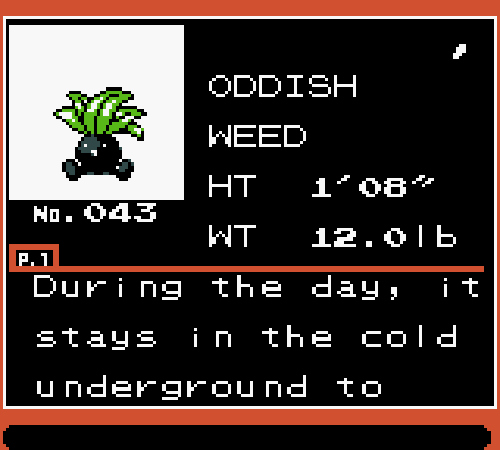

# pokedex-js
This is an in-progress replica of the Pokédex from Pokémon Crystal. I made it while practicing my CSS skills.
The project uses HTML + CSS for the Pokédex structure and vanilla JS to get Pokémon data on-demand from the [PokeAPI](https://pokeapi.co/).

Here is how the pokedex looks in the original game:

And this is how the replica implemented in this project looks like:

